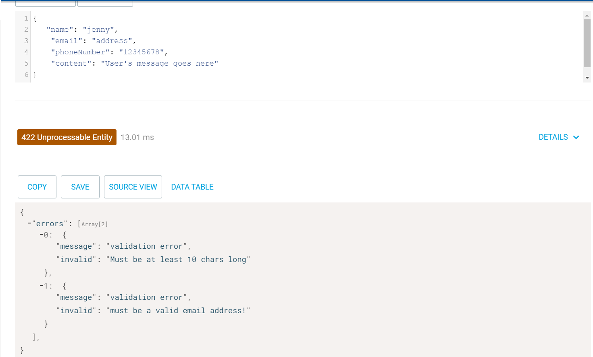

npm start port:5000

POST /contact_form/entries
once get auth, we will see the whole data and speicfic data

user.js file = register feature
auth.js file = login feature
post.js file = contact form data post or get

POST & get /contact_form/entries

POST /users and get /user

POST /auth

Error display: once login via authantication
contact-form/entries

post http://localhost:5000/user error

instruction steps :

### https://gitlab.com/shijing0628/course-project
